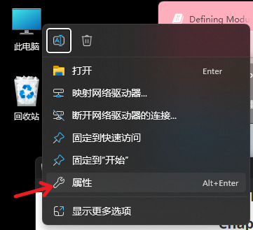

# 电赛101 入门版

*本文作者水平有限，社畜加班大脑退化，可能出现笔误或事实错误，请读者谅解*

*本文采用 [CC BY 4.0](https://creativecommons.org/licenses/by/4.0/legalcode.txt)协议*

*创建时间: 2024/10/01 🎂*


*作者: nmpassthf nmpassthf@gmail.com*

在电赛中，同学们需要编写的软件大部分是面向**低功耗Arm**芯片的，所以本教程将以 **STM32G431** 这款芯片为样例，向同学们简单介绍一下如何安装所需的开源工具并自己动手编写一个嵌入式程序。

------

[TOC]

------

## Chap 0 什么是嵌入式程序？

众所周知，以**C语言**为例，构建一个可以在桌面环境中可以运行的程序的基本步骤为: **编写Source-编译-链接-运行-(调试)** 

在嵌入式环境中，流程也是一致的，只不过和我们之前所学到的程序有些许异同: 

1、运行环境: **嵌入式程序通常是一个裸机程序，或运行在实时操作系统中**

因此，通常**不推荐**一个嵌入式程序使用堆内存。这是由于: 

- 通常情况下嵌入式环境中的认为划分给堆的内存比较少。
- 一旦出现内存泄漏几乎没有操作系统兜底。
- 引入堆内存会极大地降低程序的鲁棒性，并提高软件部分的复杂度。

2、硬件环境: **嵌入式程序通常运行在MCU中，通过GPIO、ADC、DAC等物理外设实现各类功能**

因此，一个嵌入式程序的程序本身的大小和运行时大小将受限于MCU内置的flash大小和扩展的flash、sdram存储容量。在分配栈变量和全局变量的时候需要特别注意内存的占用问题。

同时，近乎所有外设都需要程序员通过写寄存器等方式**自行初始化**。

初始化外设，并为各种外设编写程序就是嵌入式程序主要的内容。

3、编译环境: 嵌入式程序的**底层CPU架构**（ARM Cortex-M之类的）通常与你编写程序的环境（x86_64、AArch64）**不一致**

因此，为了编译并调试异构程序，我们才需要使用特殊的工具链**交叉编译**: 在本机的架构中编写、编译、链接其他架构的程序。

4、烧录和调试: 

由于嵌入式MCU通常使用内置的SRAM、flash作为存储单元，因此编译好的程序也需要使用对应的硬件烧录器将程序写入到芯片内部中。

常见的调试器同时也具备烧录的功能（例如ST的ST-LINK/V2），因此我们可以通过硬件调试器来烧录程序或者让GDB detach到嵌入式的程序中打断点调试。

## Chap 1 编写-编译-烧录-调试 所需的工具

### Chap 1.1 工具链简介

在此文中，我将介绍使用**VSCode + CubeMX + XMake (GNU make)+ Arm-none-eabi-GCC + OpenOCD**工具来构建一个嵌入式工程。

在此，不对这些开源工具做过多教程，这些工具的官网都有很详细的文档，大家可以先按照我的配置过程稍加改动，适应自己的开发板即可。

在这串工具中，我们使用: 

- **VSCode**: 编辑、浏览、调试代码。

- **CubeMX**: 创建工程并复制所需的HAL（或者LL）库到我们的工程路径，并生成我们所需的链接脚本和启动汇编。

- **交叉编译器**: ARM发行的**arm-none-eabi-gcc**。

- **OpenOCD**: 将生成的hex文件烧录到目标单片机。

- **OpenOCD+GDB**: 远程调试嵌入式程序。

可选项: 

- **Git**: 版本控制软件，方便管理源码的版本。

### Chap 1.2 自动化构建软件

对于一个源文件众多的大型应用来说，使用这类自动化构建软件可以极大地减少编译时的工作量，并加快编译速度。对于C/C++语言构建的项目来说，XMake、CMake和GNU make等一众软件都可以实现此功能。

因为选择不同的自动化构建软件会**影响到接下来配置VSCode编辑器的插件**，因此本文列出了两类区别较大的自动化构建软件。

**可以根据自身喜好选择其一使用**

[Chap3](#chap-3-使用xmake--clangd-intellisense) 中将详细介绍基于XMake工具的配置方法。

[Chap4](#chap-4-使用GNU-make--microsoft-cc-intellisense) 中将详细介绍基于GNU make工具的配置方法。

### Chap 1.3 安装前知识点

#### Chap 1.3.1 环境变量

指的是将某一个可以运行的可执行程序的**目录**添加进操作系统的Path搜索目录中。

（e.g. 将位于`C:\ENV\openocd\bin\openocd.exe` 的**openocd可执行程序**加入path，请将`C:\ENV\openocd\bin`追加写入**Path**中）

在Windows 11的操作流程为: 




Linux 下可以通过向 `/etc/profile.d/`下新增profile文件，并使用如下命令添加环境变量。

```sh
export PATH='$PATH:/usr/local/openocd/bin'
```

#### Chap 1.3.2 善用互联网

很多问题都可以在网上获取到答案。

编程类问题: 推荐使用英文在Google等搜索引擎中检索，这比留言提问高效的多 。

编译参数/软件选项/使用文档: 推荐查询对应软件的官网，都会整理出Document或Manual（注意版本号）。

e.g. [GNU Make Manual](https://www.gnu.org/software/make/manual/make.html)

## Chap 2 基础组件安装

本文中，默认读者使用最新的x86_64架构的Windows 10/11 64bit操作系统。

*对于使用Ubuntu或Fedora等Linux系统的读者，可以通过包管理器简化安装的步骤；部分配置项和路径可能与文中所列不同。*

*如果你是没有使用Linux经验的**小白**，本节中所列出的bash命令推荐使用**复制黏贴**的形式执行，避免出现拼写错误*

***文中大部分工具使用默认安装路径，请注意核对你自己的文件路径***

### Chap 2.1 STM32CubeMX

STM32CubeMX是ST公司推出的一个自动化代码生成器，我们可以通过此工具便利的下载到ST的MCU的相关开发SDK、配置MCU相关参数并自动生成工程。

我们可以从ST的官网获取此软件: [STM32CubeMX](https://www.st.com/en/development-tools/stm32cubemx.html)。

在官网下载并安装即可。

### Chap 2.2 MSYS2

> 本章节参考了[MSYS2 Installer](https://www.msys2.org/docs/installer/)

考虑到我们可能使用GNU工具链(GNU Make/GCC等工具)，获取其最便利的方式是通过MSYS2的pacman包管理器安装这些工具。

MSYS2是一个工具和库的集合，它提供了一个基于开源软件的本地构建环境，用于构建、安装和运行本地 Windows 软件。

MSYS2 Installer可以从[MSYS2 Installer distrib](https://repo.msys2.org/distrib/) 或其 Github仓库获取。

下载其中的 `msys2-x86_64-latest.exe`然后使用: 

```cmd
.\msys2-x86_64-latest.exe in --confirm-command --accept-messages --root C:/msys64
```

安装MSYS2到默认路径: `C:/msys64`中。

安装结束后在msys2 MINGW64 bash中使用如下命令更新MSYS2: 

```sh
pacman -Syyuu
```

bash重启之后使用如下命令同步并更新剩余软件包: 

```sh
pacman -Suu
```

最后将msys2 MINGW64的bin目录添加到windows的Path中即可。

> e.g. 以默认安装到`C:\msys64\`目录的MSYS2为例:
>
> 应该将`C:\msys64\mingw64\bin`添加到Windows的Path中。

### Chap 2.3 GCC

如前几节所述，由于我们需要使用交叉编译器，因此需要获取arm-none-eabi-gcc编译器。

arm-none-eabi-gcc的名字代表: 

- arm: 它编译的target是arm架构的
- none: 没有目标操作系统
- eabi: 嵌入式ABI
- gcc: GCC

在msys2 MINGW64 bash中使用如下命令安装arm-none-eabi-gcc

```sh
pacman -S mingw-w64-x86_64-arm-none-eabi-gcc
```

### Chap 2.4 OpenOCD

在msys2 MINGW64 bash中使用如下命令安装openocd

```sh
pacman -S mingw-w64-x86_64-openocd
```

### Chap 2.5 Git

> 本章节参考了 [Install inside MSYS2 proper](https://github.com/git-for-windows/git/wiki/Install-inside-MSYS2-proper)

1. 添加git-for-windows的软件源:

   1. 备份/etc/pacman.conf

      ```sh
      \cp /etc/pacman.conf /etc/pacman.conf.bak
      ```

   2. 在msys2 MINGW64 的bash中执行

      ```sh
      sed -i '/^\[mingw32\]/{ s|^|[git-for-windows]\nServer = https://wingit.blob.core.windows.net/x86-64\n\n[git-for-windows-mingw32]\nServer = https://wingit.blob.core.windows.net/i686\n\n|; }' /etc/pacman.conf
      ```

2. 更新签名:

   在bash中执行

   ```sh
   rm -r /etc/pacman.d/gnupg/
   pacman-key --init
   pacman-key --populate msys2
   ```

3. 使用git-for-windows的GPG更新签名:

   ```sh
   curl -L https://raw.githubusercontent.com/git-for-windows/build-extra/HEAD/git-for-windows-keyring/git-for-windows.gpg | pacman-key --add - && pacman-key --lsign-key E8325679DFFF09668AD8D7B67115A57376871B1C && pacman-key --lsign-key 3B6D86A1BA7701CD0F23AED888138B9E1A9F3986
   ```

4. 更新软件仓:  `pacman -Syyuu`

5. 更新结束重启bash后继续更新剩余包:  `pacman -Suu`

6. 安装git-for-windows:

   ```sh
   pacman -S mingw-w64-x86_64-{git,git-doc-html,git-doc-man} mingw-w64-x86_64-git-extra
   ```

### Chap 2.6 验证如上安装

如果你正确的安装了以上包，并且正确的将MSYS2 mingw64的`bin/`目录添加到了Path，那么遵从一下操作: 

- 打开windows CMD

- 输入`arm-none-eabi-gcc -v`命令

  ​	你将看到CMD正确的打印出来了gcc的编译选项和gcc的版本号

- 输入`openocd -v`命令

  ​	你将看到CMD正确的打印出来了Open On-Chip Debugger的版本号

- 输入`git -v`命令

  ​	你将看到CMD正确的打印出来了git的版本号

如果你的每一条命令都提示`’arm-none-eabi-gcc’ 不是内部或外部命令，也不是可运行的程序`之类的报错，那么很可能你没有正确的添加`bin/`目录到Path中。

如果某一条命令报错，则可能你对应的软件包安装有问题，可以尝试从重新使用pacman安装。

## Chap 3 使用XMake + clangd IntelliSense

*章节提示: Chap 3 和 Chap 4选择其一即可*

*个人认为目前使用体验最佳、响应速度前列、具备强大静态检查功能的工具组合*

*clangd的静态检查相关的配置网上有很多教程，这里不再详细介绍了*

### Chap 3.1 XMake和clangd安装

在msys2 MINGW64 bash中使用如下命令安装clangd:

```sh
pacman -S mingw-w64-x86_64-{clang,clang-tools-extra}
```

安装完成后，在bash中输入以下命令:

```sh
clangd --version
```

可看到clangd打印自身的版本号。

访问xmake的官网 [xmake.io](https://xmake.io) 并根据installation一节给出的教程下载安装包安装即可。

> note: 如果通过pacman命令`pacman -Sy mingw-w64-x86_64-xmake`安装
>
> 则需要在Windows Path中添加

### Chap 3.2 VSCode(clangd)安装

访问微软VSCode的官网，直接下载并安装clangd即可。

下载后只需要最少安装`clangd`和`xmake`两个插件即可开始编写和阅览项目啦~

> note: VSCode中下载xmake插件之后，需要进入vscode设置找到`xmake.compileCommandsDirectory`这个配置并将其值设置为`build`。
>
> 之后当你下次保存xmake.lua工程文件的时候，xmake插件将会自动生成clangd所需的数据库文件并保存到`./build/compile_commands.json`中。

> note: 默认情况下，clangd可能无法找到标准头文件(例如stdio.h)，此时可以在项目根目录创建`.clangd`文件，向其中添加:
>
> ```yaml
> CompileFlags:
>   Add: [
>     "-IC:/msys64/mingw64/arm-none-eabi/include/c++/13.2.1/arm-none-eabi/thumb/v7e-m+fp/hard",
>     "-IC:/msys64/mingw64/arm-none-eabi/include/c++/13.2.1",
>     "-IC:/msys64/mingw64/arm-none-eabi/include",
>   ]
>   Remove: []
> ```
>
> 其中`-IC:/msys64/`的路径是你Msys2的安装目录，后面`include/c++/13.2.1/arm-none-eabi/thumb/v7e-m+fp/hard`的路径需要根据你现在使用的mcu的指令集(`v7e-m+fp`)和你所安装的arm-none-eabi-gcc版本(`13.2.1`)决定。
>
> 你可以通过这两种方法中的一种:
>
> - 直接打开这个目录`<你MSYS2的安装目录>/mingw64/arm-none-eabi/include/c++/`
> - 输入`arm-none-eabi-gcc --version`命令
>
> 来快速确定gcc版本。

#### Chap 3.2.1 xmake.lua

XMake是一个现代的、快速的、优雅的自动化构建软件，但是由STM32CubeMX自动生成的嵌入式工程默认使用Makefile，为了减少手动配置工程这种冗杂的工作，我使用lua编写了一个简陋但是勉强"Good Enough"的Makefile解析器，它能够自动解析STM32CubeMX自动生成的Makefile文件中的所列出的编译链接参数、头和源文件路径等主要参数，并加载到xmake工程中。

xmake.lua如下:

```lua
add_rules("mode.debug", "mode.release")
set_allowedarchs("arm")
set_defaultarchs("arm")
set_allowedplats("cross")
set_defaultplat("cross")

toolchain("auto_detected_from_makefile_toolchain")
  set_kind("standalone")
  set_description("Auto detected toolchain from Makefile")
  on_load(function (toolchain)

    local makefile_table = {}
    import("makefile_luaparser.parser")
    makefile_table = parser("./mcu/Makefile")

    toolchain:set("toolset", "cc", makefile_table["CC"])
    toolchain:set("toolset", "ld", makefile_table["LD"])
    toolchain:set("toolset", "as", makefile_table["CC"])
    toolchain:set("toolset", "sh", makefile_table["CC"])
    toolchain:set("toolset", "ar", makefile_table["CC"])

    toolchain:add("asflags",makefile_table["ASFLAGS"])
    toolchain:add("cxflags",makefile_table["CFLAGS"])
    toolchain:add("ldflags",makefile_table["LDFLAGS"])

    -- for k, v in pairs(makefile_table) do
    -- print("xmake.parser " .. k .. "\t\t:\t" .. v)
    -- end

    toolchain:set("toolset", "cxx", "arm-none-eabi-g++")
    toolchain:add("cxxflags", makefile_table["CFLAGS"] .. " -std=c++17")

    print(toolchain:get("cxflags"))

    print("xmake.parser: toolchain loaded")
  end)

toolchain_end()

-- to compile the project, you need to configure as:
-- > xmake f
-- and then build the project as:
-- > xmake
target("demo-proj.elf", function (target) 
  set_toolchains("auto_detected_from_makefile_toolchain")
  set_kind("binary")
  add_files("App/Src/*.c")
  add_includedirs("App/Inc")
  set_default(true)

  set_optimize("none")

  local makefile_table = {} 
  on_load(function (target)
    -- add source files & include directories from makefile
    import("makefile_luaparser.parser")
    makefile_table = parser("./mcu/Makefile")
    for file in makefile_table["C_INCLUDES"]:gmatch("[^%s]+") do
      target:add("cincludes", file)
    end
    for file in makefile_table["AS_INCLUDES"]:gmatch("[^%s]+") do
      target:add("includedirs", file)
    end
    for file in makefile_table["LIBDIR"]:gmatch("[^%s]+") do
      target:add("linkdirs", file)
    end

    for file in makefile_table["C_SOURCES"]:gmatch("[^%s]+") do
      target:add("files", file, {rule = "c"})
    end
    for file in makefile_table["ASM_SOURCES"]:gmatch("[^%s]+") do
      target:add("files", file, {rule = "asm"})
    end
  end);


  -- generate the hex;bin file
  after_build(function (target)
    os.exec(makefile_table["HEX"] .. " " .. target:targetfile() .. " " .. target:targetfile():match("(.*).elf") .. ".hex")
    os.exec(makefile_table["BIN"] .. " " .. target:targetfile() .. " " .. target:targetfile():match("(.*).elf") .. ".bin")
    os.exec(makefile_table["SZ"] .. " " .. target:targetfile())
  end)

  -- flash the target using os.exec command
  on_run(function (target)
    -- copy the target to ./target/target.elf
    os.cp(target:targetfile(), "./target/target.elf")
    -- os.cp(target:targetfile():match("(.*).bin"), "./target/target.bin")

    local command = "openocd -f openocd.cfg -c \"program " .. target:targetfile():match("(.*).elf") .. ".hex\" " .. "-c \"reset run\" -c \"exit\""
    print("flush the target: %s", target:targetfile() .. " with argument:\n\t" .. command)
    os.exec(command)
  end)

end)
target_end()
```

其中引入的`makefile_luaparser.parser`可以在我的开源仓库中下载到: [MakefileLUAParser](https://github.com/nmpassthf/MakefileLUAParser)

主要修改的部分为:

- 指定了一个名为`auto_detected_from_makefile_toolchain`的toolchain
- 设置默认的target.elf的toolchain为`auto_detected_from_makefile_toolchain`
- 在`on_load()`中加载makefile_table中的一系列源文件和导入目录
- 在`after_build()`中使用HEX、BIN、SZ生成对应的hex、bin文件并打印elf的size
- 在`on_run()`中调用openocd读取根目录下的`openocd.cfg`配置文件，以实现自动烧录程序到单片机中

如果只是拿来用的话，可以直接使用示例中的工程，直接打开其中的`./mcu/mcu.ioc`修改为你所需的MCU，然后让STM32CubeMX重新生成Makefile即可。

#### Chap 3.2.2 工程结构

示例工程中主要结构如下:

```
. # 工程根目录, 包含xmake.lua、openocd.cfg配置文件、SVD.svd(适配你MCU的svd文件，用于gdb调试寄存器)
├─App
│  ├─Inc # 应用层头文件(*.h/*.hpp)
│  └─Src # 应用层源文件(*.c/*.cpp)
├─build #编译临时文件
│  └─cross
│      └─arm
│          └─debug # debug模式下输出的文件目录
|          └─release # release模式下输出的文件目录
├─makefile_luaparser # 我编写的LUAMakefile解析器目录
├─mcu # 此文件夹是STM32CubeMX的Makefile工程根目录, 包含Makefile和mcu.ioc等文件
│  ├─Core
│  │  ├─Inc # STM32CubeMX自动生成的头文件(*.h)
│  │  └─Src # STM32CubeMX自动生成的源文件(*.c)
│  ├─Drivers
│  │  ├─CMSIS
│  │  │  ├─Device # STM32CubeMX自动下载的CMSIS库文件
│  │  │  │  └─ST
│  │  │  │      └─STM32G4xx
│  │  │  │          ├─Include
│  │  │  │          └─Source
│  │  │  │              └─Templates
│  │  │  └─Include
│  │  └─STM32G4xx_HAL_Driver # ST提供的HAL库
│  │      ├─Inc
│  │      │  └─Legacy
│  │      └─Src
│  └─Middlewares # ST提供的中间件库(这里用DSP库举例)
│      └─ST
│          └─ARM
│              └─DSP
│                  ├─Inc
│                  └─Lib
└─target # 从build文件夹中自动复制出来的target.elf
```

因此，当你尝试切换MCU的时候，只需要替换目录下整个`./mcu/`文件夹，然后修改openocd.cfg适配新开发板并下载对应的svd文件即可，无需再做大规模变动。

## Chap 4 使用GNU make + Microsoft C/C++ IntelliSense

*章节提示: Chap 3 和 Chap 4选择其一即可*

### Chap 4.1 GNU make安装

`pacman -S mingw-w64-x86_64-make`

### Chap 4.2 VSCode(ms IntelliSense)安装

与[Chap 3.2](#chap-32-vscodeclangd安装)类似，只是需要安装的插件更换为

- 微软提供的C/C++插件
- Makefile插件

然后在C/C++插件中配置Include Path到`<你MSYS2的安装目录>/mingw64/arm-none-eabi/include/*`即可。